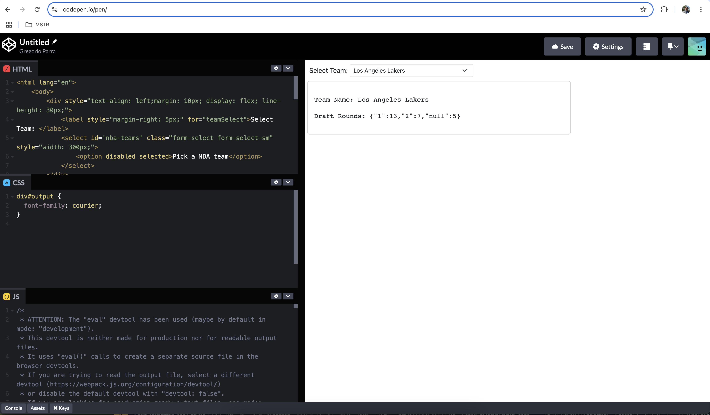

# Project Name

This TypeScript project provides tools for analyzing and managing NBA draft data. It includes a variety of utility functions for processing player data, such as counting players by draft rounds, along with unit tests implemented in Jest to ensure code accuracy and reliability. You can view the full **assessment requirements** [here](NBA-Initial-Assessment.html).

Search capability uses the NBA team's **full name** (`full_name`) property in JSON structure (see below) to filter the list of teams or perform the draft analysis.

```json
{
  "data": [
    {
      "id":1,
      "conference":"East",
      "division":"Southeast",
      "city":"Atlanta",
      "name":"Hawks",
      "full_name":"Atlanta Hawks",
      "abbreviation":"ATL"
    },
    ...
  ]
}
```

There are two ways to test and validate this assessment:

1. **Using CodePen**: You can validate functionality directly on CodePen by pasting the contents of the files under the `dist` folder into a new CodePen project. For detailed instructions, refer to the [CodePen Deployment and Test](#codepen-deployment-and-test) section below. **Code needs to be built first**.

2. **Command Line Testing**: You can build and test the project from the command line using **NPM**. The project can be run, built, and tested through various NPM scripts, which are documented in the [Usage](#usage) and [Command Line Testing](#command-line-testing) sections.

## Table of Contents
- [Project Overview](#project-overview)
- [Installation](#installation)
- [Usage](#usage)
- [Scripts](#scripts)
- [Testing](#testing)
- [Folder Structure](#folder-structure)
- [CodePen deployment and test](#codepen-deployment-and-test)
- [Contributing](#contributing)
- [License](#license)

## Project Overview

This project contains utility functions and data models for working with NBA player draft data. One of the core functions, `countDraftRounds`, processes player data to count the number of players selected in each draft round, supporting draft analytics and team insights.

## Installation

1. **Clone the repository**:
   ```bash
   git clone https://github.com/gparraMstr/nba-draft-analysis.git
   cd your-repo-name
   ```

2. **Install dependencies**:
   Make sure you have Node.js installed, then run:
   ```bash
   npm install
   ```

3. **Install Jest for Testing (if not already installed)**:
   ```bash
   npm install --save-dev jest ts-jest @types/jest
   ```

## Usage

### Example: Counting Draft Rounds

The `countDraftRounds` function takes an array of `Player` objects and returns an object with counts of players per draft round.

#### Sample Code:

```typescript
import { countDraftRounds } from './src/calculateRounds';
import { Player } from './src/objectTypes';

const players: Player[] = [
  { draft_round: 1 },
  { draft_round: 1 },
  { draft_round: 2 },
  { draft_round: null },
];

const draftRounds = countDraftRounds(players);
console.log(draftRounds); // Output: { '1': 2, '2': 1, 'null': 1 }
```

### Build the Application

Use NPM commands to **first build** the application:

```bash

$ npm run build

```

### Running the Application

After building the application, then use NPM commands to execute the application (example script in `src/index.ts`) from command-line (see examples below). You can specify the full name of the NBA team as parameter; if not specified, then it defaults to "Golden State Warriors".

```bash
$ npm run start

> start
> node dist/bundle.js

Team Name: Golden State Warriors
Draft Rounds: { '1': 13, '2': 7, null: 5 }

```

Example below shows how to indicate the **NBA team's full name** as an argument (i.e. `Denver Nuggets`) to get the draft analysis results:

```bash
$ npm run start -- "Denver Nuggets"

> start
> node dist/bundle.js Denver Nuggets

Team Name: Denver Nuggets
Draft Rounds: { '1': 16, '2': 4, null: 5 }

```

## Scripts

- **`npm run start`**: Run the main application script.
- **`npm run start -- 'Denver Nuggets'`**: Run the application script with NBA team name as parameter's value
- **`npm run test`**: Run Jest tests.
- **`npm run build`**: Compile TypeScript files into JavaScript (optional setup if using a build process).

## Testing

Jest is used for unit testing in this project. Tests are located in the `__tests__` directory within the `src` folder.

### Running Tests

To run all tests:

```bash
npm test
```

### Test Coverage

To check test coverage, run:

```bash
npm run test -- --coverage
```

### Example Test: `countDraftRounds`

The `countDraftRounds` function has unit tests covering various scenarios, such as:

- Counting players drafted in rounds 1 and 2.
- Handling players with `draft_round` set to `null`.
- Ensuring unexpected rounds (e.g., round 3) are counted as `"null"`.
- Verifying behavior for an empty player list.

Example test output:

```bash
PASS  src/__tests__/countDraftRounds.test.ts
✓ should count players drafted in round 1 and round 2
✓ should count players with draft_round as null
✓ should handle players with draft_round greater than 2 by counting them as null
✓ should return an empty record for an empty player list
```

## Folder Structure

```
project-root/
├── dist/                             # CODEPEN
│   ├── bundle.js                     # JavaScript file with all logic
│   ├── index.html                    # HTML code to render the Draft analysis output
│   ├── nba.css                       # CSS classes to dress the HTML output
├── src/
│   ├── calculateRounds.ts            # Utility functions for NBA Analysis
│   ├── objectTypes.ts                # NBA Type definitions
│   ├── apiClient.ts                  # NBA REST API function
│   ├── storage.ts                    # Data Caching functions
│   ├── index.ts                      # Main script entry
│   └── __tests__/                    # Jest tests
│       ├── countDraftRounds.test.ts  # Unit test for countDraftRounds calculation
│       └── apiClient.test.ts         # Unit test for API calls to fetch NBA data
├── jest.config.js                    # Jest configuration file
├── tsconfig.json                     # TypeScript configuration file
├── package.json                      # NPM build configuration file
├── webpack.config.json               # Webpack configuration file to generate CODEPEN JS file.
└── README.md                         # Project documentation
```

## CodePen deployment and test

1. Create an empty PEN project.
2. Copy contents from `bundle.js` file into **JavaScript** editor panel.
3. Copy contents from `index.html` filde into **HTML** editor panel.
5. Copy contents from `nba.css` filde into **CSS** editor panel.
6. Verify rendering shows form with pull-down menu.
7. Select a NBA team and wait for draft analysis count is shown



## Contributing

Contributions are welcome! Please fork the repository and create a pull request with your changes. Make sure your code follows project standards and includes relevant tests.

### Steps to Contribute
1. Fork the repository.
2. Create a new branch (`git checkout -b feature/YourFeature`).
3. Commit your changes (`git commit -am 'Add a new feature'`).
4. Push to the branch (`git push origin feature/YourFeature`).
5. Open a pull request.

## License

This project is licensed under the MIT License. See the [LICENSE](LICENSE) file for details.
